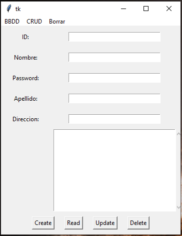

# Notas-con-BBDD

### Requisitos 
- Python 
- Libreria Tkinter
- Libreria sqlite3

### Descripción
-Una Iterface que guarda formularios dentro de una base de datos local; id, correo, contraseña
y otras notas. Podemos crear una BBDD o modificar la existente. Solo podemos usar tener una en uso.
